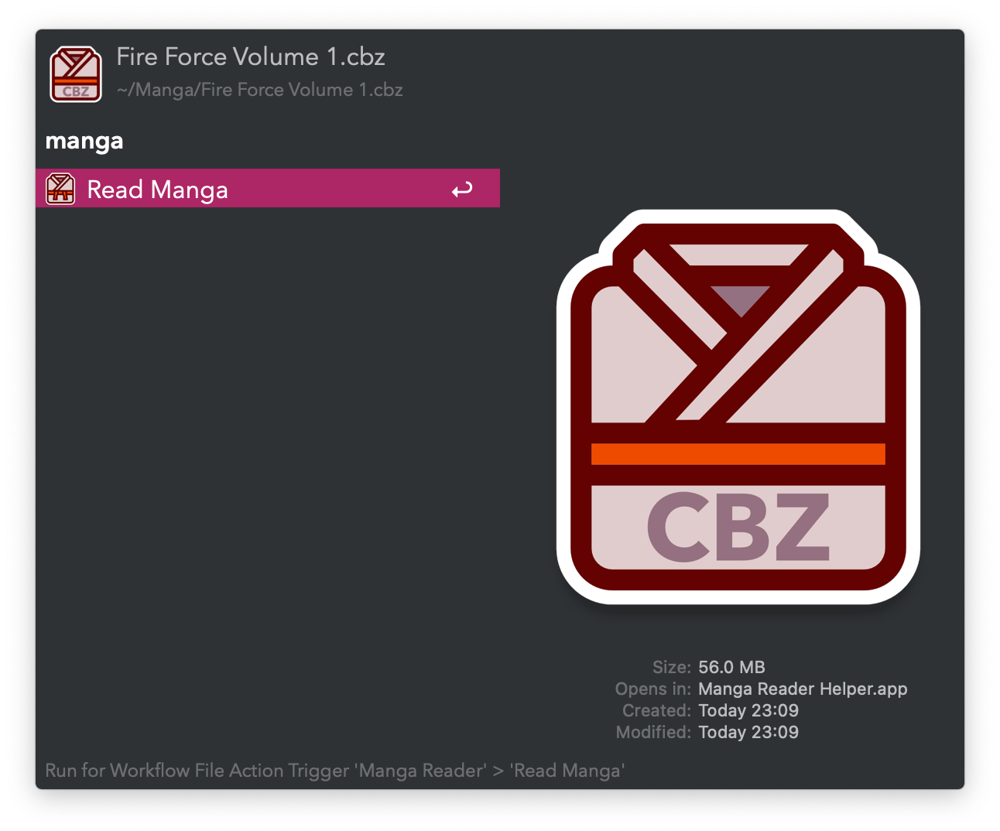
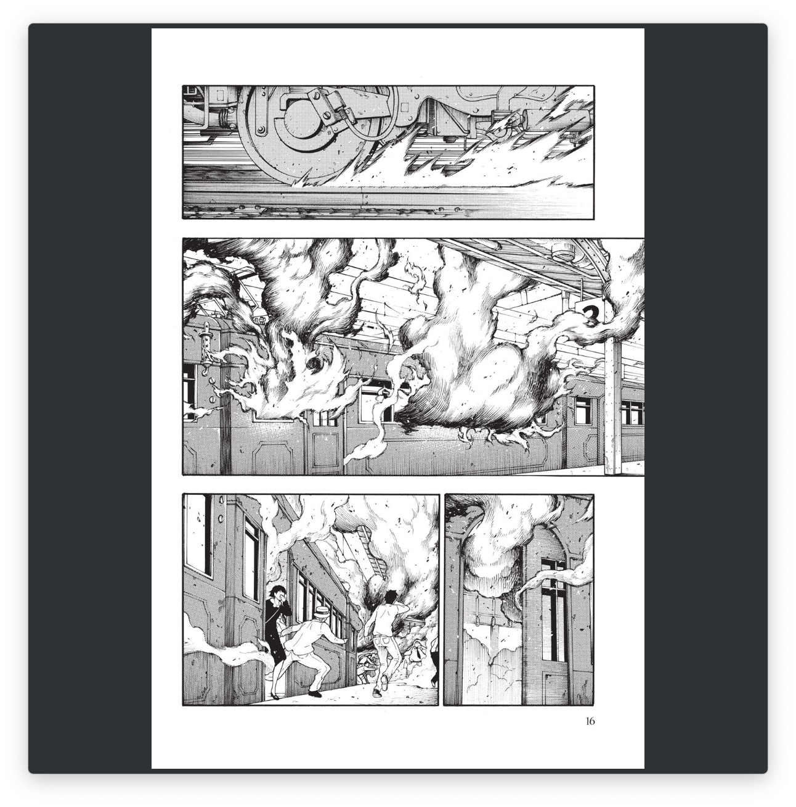
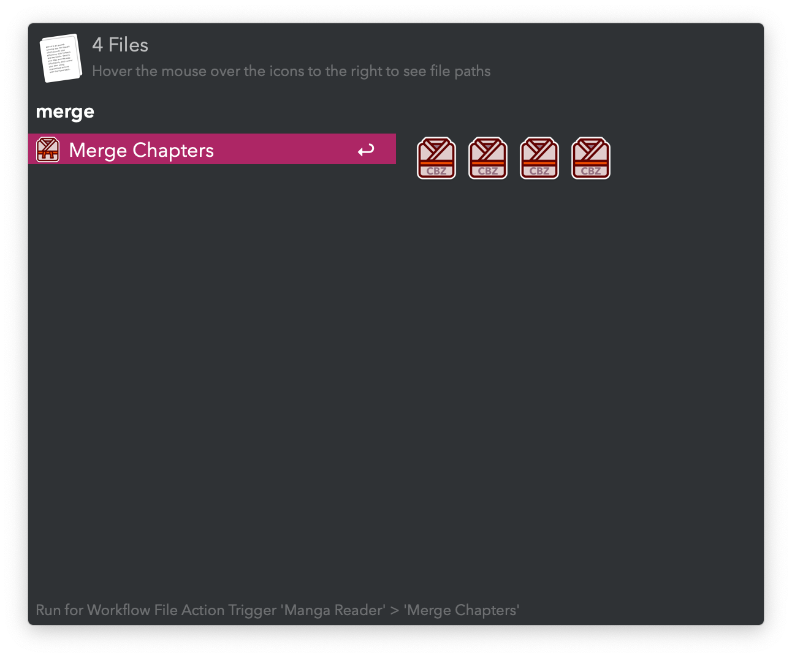

#  Manga Reader Alfred Workflow

Read Manga and Comics

[⤓ Install on the Alfred Gallery](https://alfred.app/workflows/vitor/manga-reader)

## Usage

Read Manga and Comic Books via the [Universal Action](https://www.alfredapp.com/help/features/universal-actions/). Supported formats include CBZ, ZIP, and PDF.

* <kbd>←</kbd> Previous page.
* <kbd>→</kbd> Next page.
* <kbd>↩&#xFE0E;</kbd> Save current position and exit.

When rerunning the Universal Action on the same file in the same location, pages prior to the last saved position are excluded. To reinclude all pages and start from the beginning, use the Universal Action with <kbd>⌘</kbd><kbd>↩&#xFE0E;</kbd>.

Merge different chapters into a single file via the `Merge Chapters` Universal Action.

